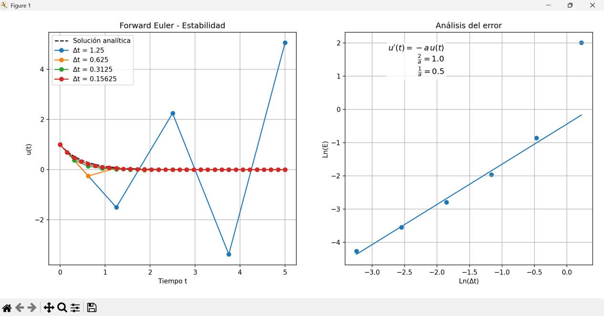

# Mini-Proyecto 2: Estabilidad y Orden de Métodos Numéricos

Este proyecto se centra en la aplicación de diferentes esquemas de diferencias finitas para resolver un problema de decaimiento exponencial. El objetivo principal es realizar experimentos virtuales para analizar y verificar las propiedades de estabilidad y el orden de convergencia de cada método.

---

---

### Métodos Numéricos Analizados

Para este estudio, se implementan y analizan tres esquemas de solución numérica:

1.  **Método de Euler Explícito (Forward Euler)**: Este es un esquema condicionalmente estable, que requiere que el paso de tiempo ($\Delta t$) cumpla la condición $\Delta t < 2/a$ para evitar soluciones crecientes y $\Delta t < 1/a$ para evitar soluciones oscilatorias.
2.  **Método de Crank-Nicolson**: Este es un esquema incondicionalmente estable con respecto a soluciones crecientes. Sin embargo, es condicionalmente estable con el criterio $\Delta t < 2/a$ para evitar soluciones oscilatorias.
3.  **Método de Euler Implícito (Backward Euler)**: Este esquema es incondicionalmente estable para ambas, soluciones crecientes y oscilatorias, lo que significa que "cualquier $\Delta t$ funcionará".

---

### Objetivos del Experimento

El experimento virtual se diseñó para:

* **Verificar** las tres afirmaciones sobre la estabilidad de los métodos de Forward Euler, Crank-Nicolson y Backward Euler.
* **Encontrar** las zonas de linealidad entre el logaritmo del error y el logaritmo del paso de tiempo. Esta relación es crucial para determinar el orden de aproximación del método.
* **Estimar** la pendiente de esta relación lineal para cada uno de los tres esquemas.
* **Discutir** el valor de estas pendientes y cómo se relacionan con el orden teórico de aproximación de cada método.

### Cálculo del Error Numérico

Para la estimación del error se utiliza la norma dada por la ecuación 1.57. Este valor único expresa el tamaño del error numérico para cada simulación, denominado $E$:

$$E = \sqrt{\Delta t \sum_{n=0}^{N_t} (e^n)^2}$$

donde $e^n$ es el error en el paso de tiempo $n$, y $N_t$ es el número total de pasos.

---

### Resultados Gráficos y Discusión

A continuación, se presentan los resultados gráficos obtenidos para cada uno de los métodos. Las imágenes deben ser almacenadas en la carpeta `docs` con los nombres especificados.

#### **1. Método de Euler Explícito (Forward Euler)**

La gráfica de estabilidad muestra cómo la solución explícita diverge y se vuelve inestable cuando el paso de tiempo ($\Delta t$) supera el valor crítico. La gráfica de análisis de error a la derecha, muestra una clara relación lineal en escala logarítmica para pasos de tiempo pequeños, cuya pendiente corresponde al orden del método.

#### **2. Método de Crank-Nicolson**

El gráfico de estabilidad del método de Crank-Nicolson muestra que, a pesar de las oscilaciones para un $\Delta t$ grande, la solución se mantiene acotada, lo que confirma su estabilidad incondicional frente a soluciones crecientes. El análisis de error muestra una relación lineal con una pendiente que se espera que sea cercana a 2, lo que valida su orden de aproximación.

#### **3. Método de Euler Implícito (Backward Euler)**

Este método demuestra ser incondicionalmente estable, manteniendo su solución sin oscilaciones ni divergencia incluso para un $\Delta t$ grande. La gráfica de análisis de error también presenta una relación lineal, con una pendiente que debería confirmar su naturaleza de primer orden, similar a la del método de Forward Euler.

Se espera que la relación entre el logaritmo del error y el logaritmo del paso de tiempo sea lineal. La pendiente de esta línea recta representa el orden de precisión del método. Para los métodos de **Forward y Backward Euler**, se prevé que la pendiente sea cercana a 1, confirmando su naturaleza de primer orden. Para el método de **Crank-Nicolson**, la pendiente esperada es cercana a 2, lo que demuestra su aproximación de segundo orden.

---

### Archivos del Proyecto

* `src/`: Contiene el código fuente que implementa los esquemas de diferencias finitas y realiza los experimentos.
* `docs/`: Aquí se encuentran los gráficos de log(E) vs log(Δt) y cualquier análisis adicional.
* `data/`: Almacena los datos generados por las simulaciones, si es aplicable.

---

### Instrucciones de Uso

1.  Clona este repositorio.
2.  Instala las dependencias necesarias.
