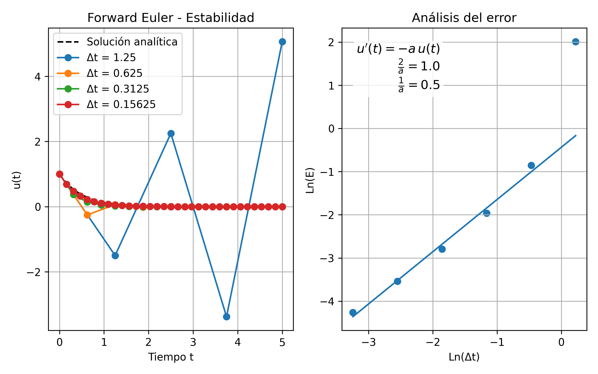
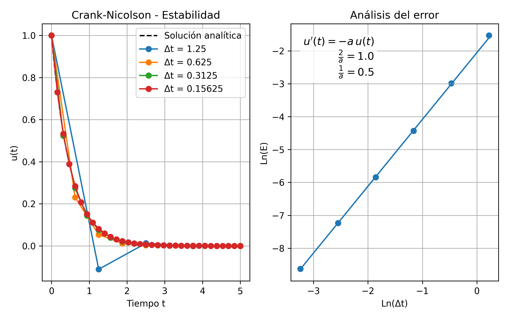
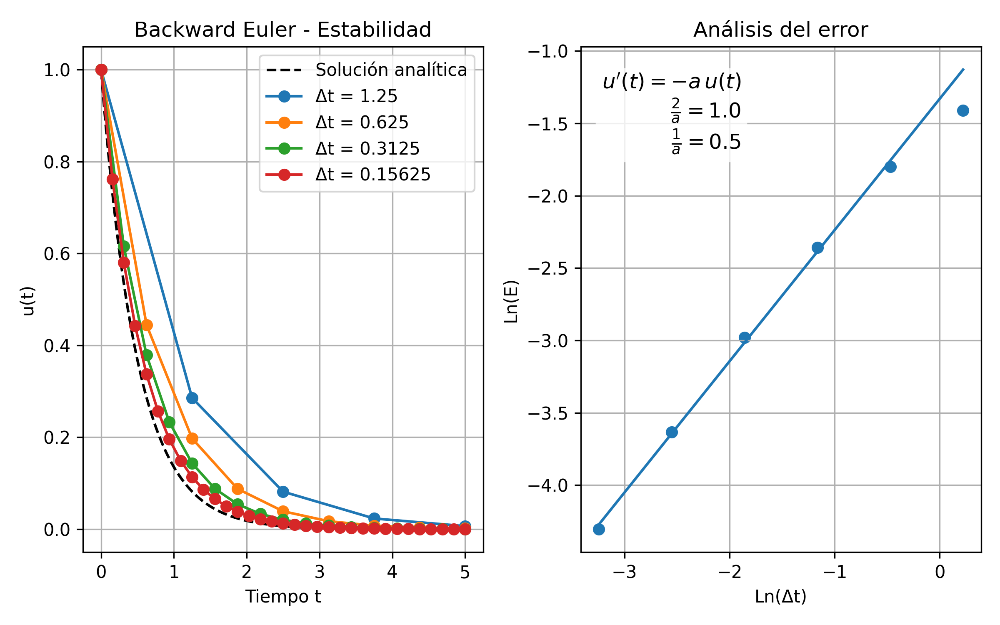

# Punto 2: Estabilidad y Orden de Métodos Numéricos

Este proyecto aplica distintos esquemas de diferencias finitas para resolver la ecuación de decaimiento exponencial. El propósito es comprobar en la práctica la estabilidad de cada método y estimar su orden de convergencia a partir del análisis del error.

---

### Métodos Numéricos Analizados

Se trabajó con tres esquemas de integración temporal:

1. **Euler Explícito (Forward Euler):** Método condicionalmente estable. Requiere que el paso de tiempo cumpla delta t < 2/a para evitar crecimiento no físico y delta t < 1/a para que no aparezcan oscilaciones.
2. **Crank-Nicolson:** Es incondicionalmente estable respecto a crecimiento, pero puede presentar oscilaciones si delta t > 2/a.
3. **Euler Implícito (Backward Euler):** Es incondicionalmente estable tanto frente a crecimiento como a oscilaciones.

---

### Objetivos del Experimento

- Verificar de manera práctica la estabilidad de los tres métodos.  
- Encontrar la relación entre log(E) y log(delta t) para estimar el orden de convergencia.  
- Comparar los resultados con los órdenes teóricos.  

---

### Cálculo del Error

El error global de cada simulación se midió con la norma:

`E = sqrt(Δt * Σ (e^n)^2)`

donde e^n es el error puntual en el tiempo t_n.  

---

### Resultados, Gráficos y Discusión

Las simulaciones se realizaron con delta t = [1.25, 0.625, 0.3125, 0.15625, 0.078125, 0.0390625], usando a=2.  

#### **1. Forward Euler**
Para delta t = 1.25 el método diverge, confirmando que no cumple la condición de estabilidad, mientras que para delta t = 0.625 la respuesta es oscilatoria, pero decreciento. Con pasos más pequeños, la solución se mantiene estable y el análisis log–log del error muestra una zona lineal con pendiente cercana a 1.  

#### **2. Crank-Nicolson**
Se mantuvo estable incluso con delta t = 1.25, aunque en ese caso aparecieron oscilaciones. Para pasos menores, el error decrece con pendiente cercana a 2 en la gráfica log–log, como se espera para un método de segundo orden.  

#### **3. Backward Euler**
El esquema implícito fue estable en todos los casos, sin oscilaciones ni divergencias. El error se redujo de forma lineal en escala log–log, con pendiente cercana a 1.  

---

### Conclusiones

Los valores estimados de pendiente fueron:  

- Forward Euler: 1.21 → error relativo ≈ 20.9 % respecto al orden teórico (1).  
- Crank-Nicolson: 2.03 → error relativo ≈ 1.5 % respecto al orden teórico (2).  
- Backward Euler: 0.91 → error relativo ≈ 9.3 % respecto al orden teórico (1).  

En general, los resultados coinciden con lo esperado: Forward y Backward Euler se comportan como métodos de primer orden, mientras que Crank-Nicolson alcanza segundo orden. Las pequeñas diferencias entre valores teóricos y experimentales se deben al rango finito de \(\Delta t\) usado y a los efectos numéricos acumulados. El experimento permitió confirmar de manera clara tanto la estabilidad como los órdenes de convergencia de los tres esquemas.

---

### Archivos del Proyecto

- `docs/`: Gráficas de estabilidad y error.  

---

### Instrucciones de Uso

1. Clonar el repositorio.  
2. Instalar dependencias necesarias.  
3. Ejecutar el script dentro de la carpeta llamada Punto 2.
