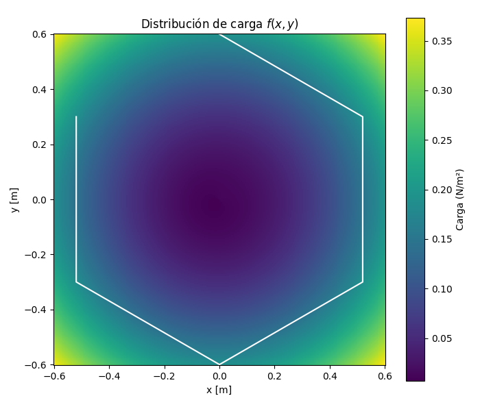
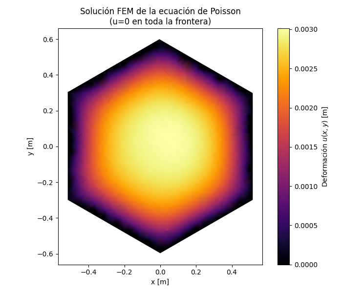
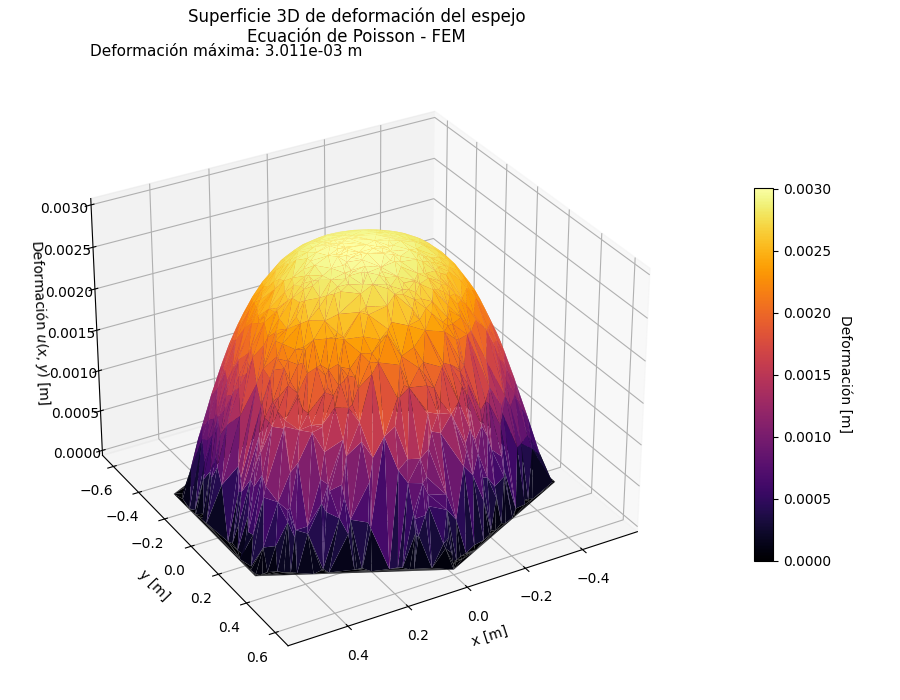
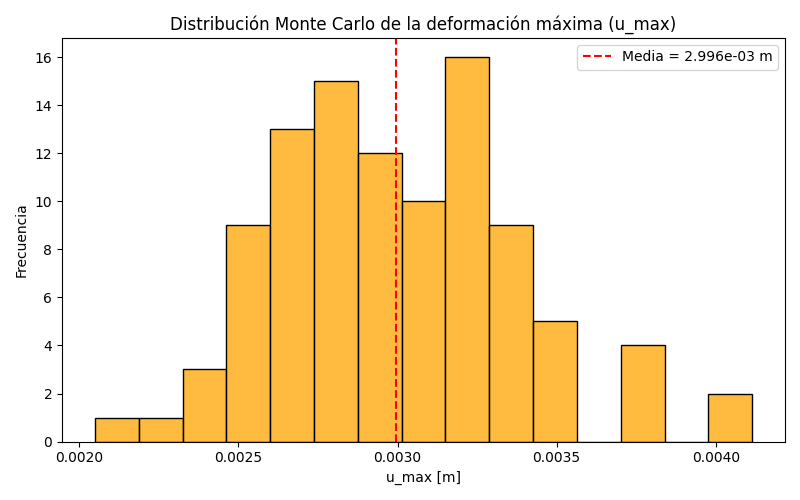
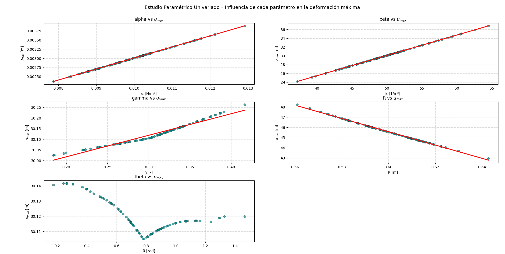

# Punto 2. Análisis FEM de Deformación en un Espejo Hexagonal — Ecuación de Poisson

## Descripción General
Este proyecto implementa un **análisis por elementos finitos (FEM)** de la **deformación superficial** de un espejo con geometría **hexagonal**, sometido a una carga espacial simulada descrita por la **ecuación de Poisson**:
$$
\[
\nabla^2 u(x,y) = -f(x,y)
\]
$$
donde \(u(x,y)\) representa la deformación del espejo y \(f(x,y)\) la carga distribuida.  
El objetivo es analizar cómo las variaciones en los parámetros físicos de la carga afectan la deformación máxima del espejo y, por ende, la calidad óptica de la imagen reflejada.

---

## Modelo Físico

La carga aplicada se define como:

\[
f(x,y;\alpha,\beta,\gamma,\theta) = \alpha \, [1 + \beta r^2 + \gamma \cos(\phi - \theta)]
\]

donde:

| Parámetro | Significado | Unidad | Rango usado |
|------------|-------------|---------|--------------|
| \(\alpha\) | Intensidad base de carga | N/m² | 0.01 – 0.1 |
| \(\beta\)  | Gradiente radial | 1/m² | 3 – 10 |
| \(\gamma\) | Amplitud de asimetría angular | – | 0.1 – 0.3 |
| \(\theta\) | Dirección del máximo de carga | rad | 0 – 2π |
| \(R\)      | Radio del espejo | m | 0.6 |

> Estos valores fueron ajustados para representar **condiciones realistas** de un espejo de laboratorio o espacial, evitando presiones irreales que producirían deformaciones de varios metros (antes \alpha\ era demasiado grande).

---

## Metodología

1. **Definición del dominio:**  
   Se genera un dominio hexagonal de radio \(R = 0.6\,m\) mediante triangulación de Delaunay.

2. **Ecuación de Poisson:**  
   Se resuelve con condiciones de frontera de **Dirichlet homogéneas** (\(u=0\) en todo el borde), simulando un espejo rígido soportado por su contorno.

3. **Ensamblaje FEM:**  
   - Se construye la matriz de rigidez \(K\) y el vector de fuerzas \(F\).  
   - Se aplica la carga \(f(x,y)\) en cada elemento.  
   - Se obtiene la solución \(u = K^{-1} F\).

4. **Análisis Monte Carlo:**  
   Se realizaron 100 simulaciones variando aleatoriamente los parámetros \((R,\alpha,\beta,\gamma,\theta)\) para evaluar la variabilidad de la deformación máxima.

5. **Análisis Paramétrico:**  
   Se estudió la influencia individual de cada parámetro sobre la deformación máxima \(u_{max}\).

---

## Resultados

### 🔹 Distribución de carga
  

---

### 🔹 Solución FEM 2D
  
El espejo se deforma con un perfil parabólico suave, alcanzando una deformación máxima de:

\[
u_{max} = 3.0\times10^{-3}\ \text{m} \; (3.0\ \text{mm})
\]

---

### 🔹 Superficie 3D de deformación
  
La solución tridimensional muestra una curvatura simétrica decreciente hacia los bordes, acorde con las condiciones de contorno.

---

### 🔹 Distribución Monte Carlo
  
La distribución de \(u_{max}\) sigue una forma aproximadamente normal:  
\[
\overline{u_{max}} \approx 2.99\times10^{-3}\,m, \quad \sigma \approx 2.5\times10^{-4}\,m
\]

---

### 🔹 Correlación entre parámetros y deformación máxima


| Parámetro | Correlación con \(u_{max}\) | Interpretación |
|------------|-----------------------------|----------------|
| \(\alpha\) | +0.79 | Mayor carga → mayor deformación. |
| \(\beta\)  | +0.65 | Aumenta el efecto en el borde. |
| \(\gamma\) | -0.05 | Influencia leve, direccional. |
| \(R\)      | +0.09 | Geométricamente amplifica ligeramente \(u\). |
| \(\theta\) | ≈ 0 | No altera la magnitud global. |

---

### 🔹 Estudio Paramétrico
  
Los resultados univariados muestran relaciones casi lineales entre \(u_{max}\) y los parámetros \(\alpha\), \(\beta\), y \(R\), mientras que \(\theta\) presenta una oscilación periódica, coherente con su efecto angular.

---

## Consideraciones Físicas

- Deformaciones del orden de **milímetros** producirían una **pérdida total del enfoque óptico** en un telescopio o instrumento de precisión.  
- Para comparación, el **James Webb Space Telescope** corrige deformaciones menores a **30 nanómetros**, unas **100.000 veces menores** que las obtenidas aquí.  
- A escalas de laboratorio, una deformación de \(3\times10^{-3}\,m\) sigue siendo útil para verificar el comportamiento estructural, pero **no óptico**.  
- La carga usada representa un caso de estrés mecánico exagerado, ideal para validar el código y el comportamiento numérico del método FEM.

---

## Conclusiones

- El parámetro **\(\alpha\)** (intensidad base de carga) es el factor dominante en la deformación.  
- **\(\beta\)** controla la curvatura radial, aumentando la deformación en los bordes.  
- **\(\gamma\)** y **\(\theta\)** modifican la forma, no la magnitud de \(u_{max}\).  
- El modelo FEM responde de manera estable ante variaciones paramétricas y reproduce el comportamiento parabólico esperado de una superficie cargada.  
- Aunque los valores absolutos de \(u_{max}\) son altos, las tendencias físicas coinciden con el comportamiento estructural de espejos bajo carga distribuida.

---

## Archivos del Proyecto

| Archivo | Descripción |
|----------|--------------|
| `script.py` | Contiene el código fuente que implementa el solver FEM, las simulaciones Monte Carlo y los análisis paramétricos. |
| `load_distribution.png` | Distribución espacial de la carga \(f(x,y)\). |
| `fem_solution.png` | Solución FEM de la ecuación de Poisson (vista 2D). |
| `3d_def.png` | Superficie 3D de la deformación del espejo. |
| `montecarlo_hist.png` | Histograma de la distribución Monte Carlo de \(u_{max}\). |
| `correlation.png` | Diagrama de correlación entre parámetros y deformación. |
| `parametros.png` | Estudio paramétrico univariado de la relación \(u_{max}\)–parámetro. |

---

## Instrucciones de Uso

1. **Clonar el repositorio:**
   ```bash
   git clone https://github.com/tu_usuario/analisis-poisson-espejo.git
2. **Instala depencencias necesarias**
numpy scipy matplotlib seaborn pandas
